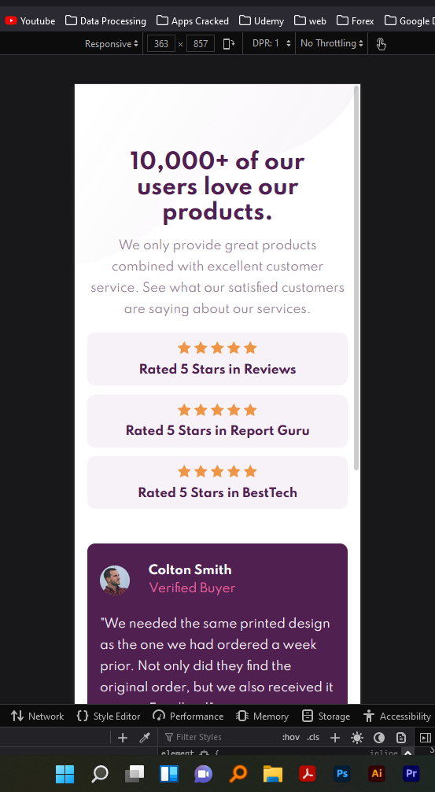
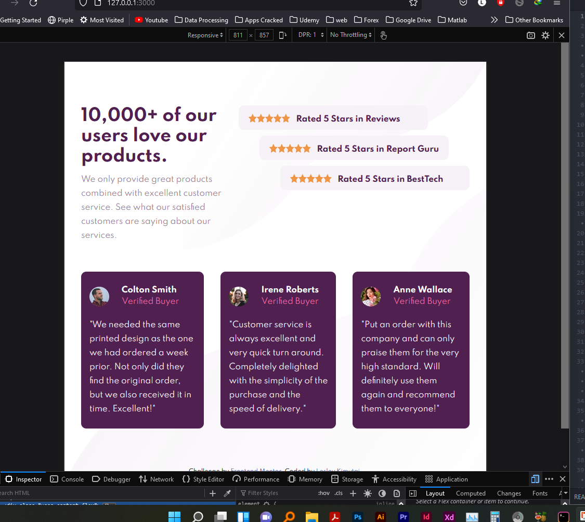
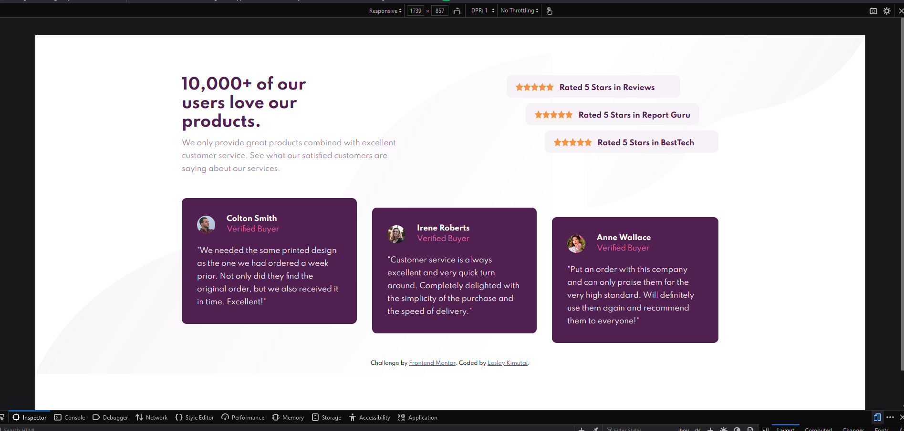

# Frontend Mentor - Social proof section solution

This is a solution to the [Social proof section challenge on Frontend Mentor](https://www.frontendmentor.io/challenges/social-proof-section-6e0qTv_bA). Frontend Mentor challenges help you improve your coding skills by building realistic projects.

## Table of contents

- [Overview](#overview)
  - [The challenge](#the-challenge)
  - [Screenshot](#screenshot)
  - [Links](#links)
- [My process](#my-process)
  - [Built with](#built-with)
  - [What I learned](#what-i-learned)
- [Author](#author)
- [Acknowledgments](#acknowledgments)


## Overview

### The challenge

Users should be able to:

- View the optimal layout for the section depending on their device's screen size

### Screenshot



#### Mobile View :-



#### Tablet View :-
Here's a feel of the tablet view of the design




#### Laptop Design :-

up here ☝🏽


### Links

- Solution URL: [Solution :- ](https://github.com/issagoodlifeInc/socproof-sec.git)
- Live Site URL: [Github Pages :- ](https://socproof-sec.netlify.app/)

## My process

### Built with

- Semantic HTML5 markup
- CSS custom properties
- Flexbox
- Mobile-first workflow

### What I learned

Transforming elements can do the job of moving elements better even than all the while using absolute/relative positioning combo🤜🏽

```css
.user_ratings .rat1 {
  transform: translateX(-80px);
}

.user_ratings .rat2 {
  transform: translateX(-40px);
}
}
```
- Used the above to handle the ratings side movement 💯

## Author

- Website - [Lesley Kimutai](https://leskimfamily.herokuapp.com/lesley)
- Frontend Mentor - [Leskim](https://www.frontendmentor.io/profile/Leskim)
- Facebook - [lesley.kimutai](https://www.facebook.com/lesley.kimutai)


## Acknowledgments

Cecil Kipchirchir - Yeah he helped ... moral support 😅
- Website - [Cecil Kipchirchir](https://github.com/CEC-IL)
